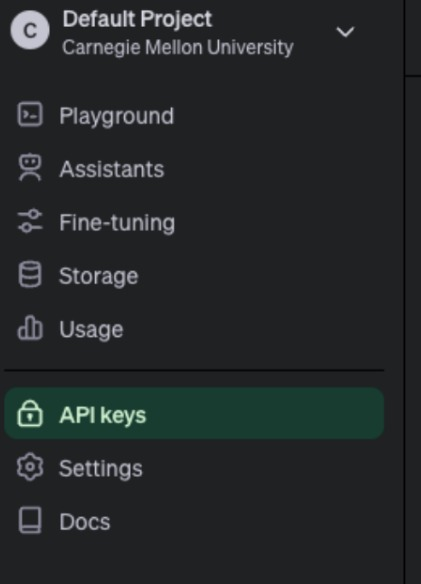

# 90835_dshs_mvp

## About
This system generates discharge summaries for patients and healthcare professionals using the OpenAI Large Language Model, along with backend coding to produce patient discharge summary letters for users.

## Installation
Before running the code, please ensure that you have installed the following packages in your environment using the command **'pip install [package_name]'**:
- streamlit
- Json
- openai
- PyPDF2
- os
- pandas

## Pre-Requisites
To obtain an OpenAI Key for using the UI, please follow these steps:
1.  Visit this link: https://platform.openai.com/apps
2.  Log in to your account.
3.  Select "API".

4.  Choose "API keys" on the right side of the page.

5.  Click on “Create new secret key”.

6.  Provide a name for the new secret key and select "Create secret key".

7.  Open the file named "credential.json" and paste your OpenAI key into the designated bracket. "openai_api_key": "your OpenAI Key"

## Activate the UI 
To activate the UI, follow these three steps:
1.  Open the file named 'user_interface_v15.py'.
2.  Ensure that the directory of your file is the same as the directory where you intend to run it. If not, you can use the command **'cd~ [your_directory]'** to navigate to the correct location.
3.  Run the command **'streamlit run user_interface_v15.py'** to activate the UI.

## Usage
1.  Select Patient Name / Patient ID
The UI provides a dropdown menu or a search bar where the physician can select or search for a patient's name or patient ID. This allows the physician to easily locate the patient they are interested in.

2.  Display Patient Information
Once the physician selects a patient, relevant information about the patient can be displayed. This includes basic demographics (e.g., age, gender), admission details (e.g., date of admission, discharge date), and any other relevant information available in the dataset.

3.  Assess Patient Readiness for Discharge
Once the physician selects a patient, the system will assess whether the patient is prepared for discharge. If not, a warning message will be displayed stating, "This patient is not safe for discharge!" to alert the physician that the patient is not yet ready.

4.  Choose Inclusion of Personally Identifiable Information (PII)
Offer physicians the option to specify whether they want to include personal information such as name, patient ID, age, and gender in the discharge summary. If they prefer not to include PII, they can select "without PII"; otherwise, they can choose "with PII" to include this information.

5.  Generate Discharge Summary Button
A "Generate Summary" button will be provided. When clicked, this button triggers the system to generate the discharge summary letter for the selected patient based on the input data.

6.  Display Generated Summary
Below the button, a section should be dedicated to displaying the generated discharge summary letter. This area should dynamically update whenever a new summary is generated.

7.  Error Handling
Error messages should be displayed in case of any issues, such as if the selected patient does not have sufficient data available for generating a summary.

